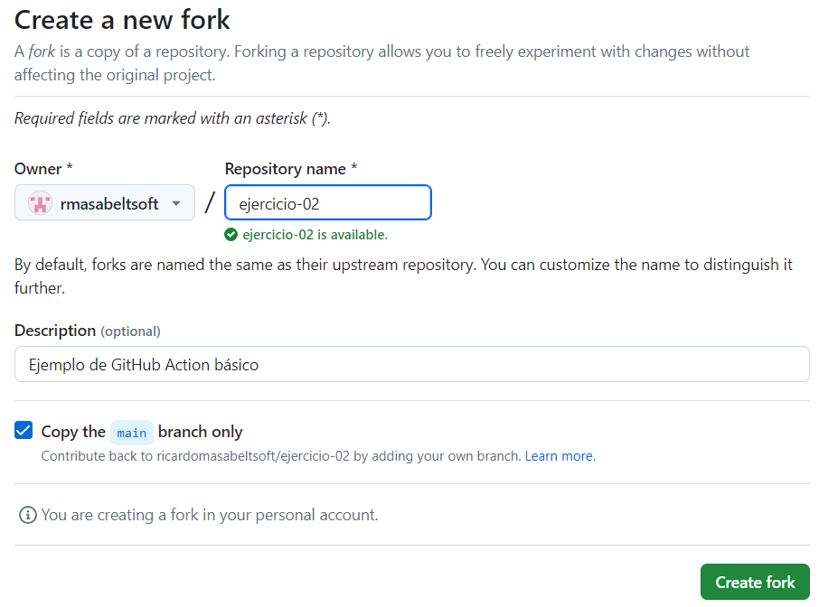
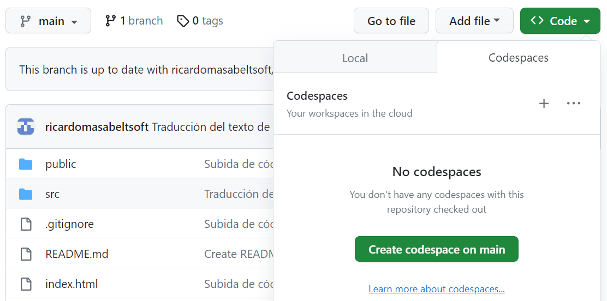
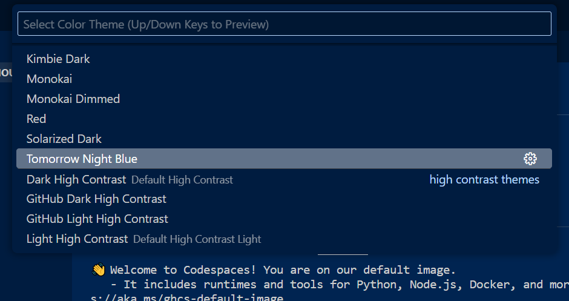
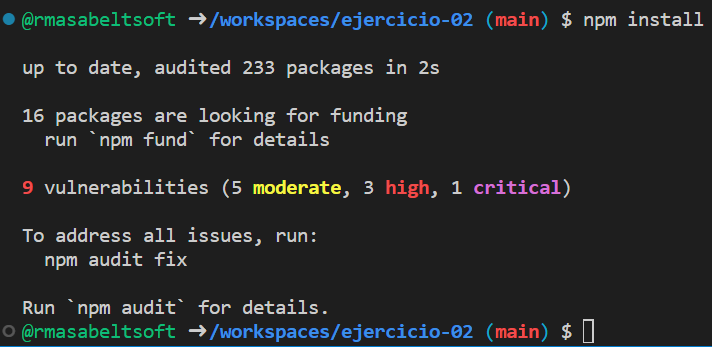
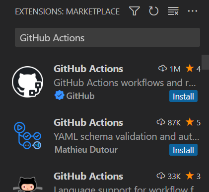

# Ejercicio 02 - Ejemplo de GitHub Action básico

La aplicación en el presente repositorio es un ejemplo muy simple basado en React, con el que vamos a experimentar los primeros pasos con GitHub Actions.

A continuación tenemos 2 secciones claramente diferenciadas. La primera detallará los pasos que debemos seguir para preparar nuestro entorno para el desarrollo del ejercicio. Y la segunda parte detalla el desarrollo completo de los ejercicios, paso a paso.

## Preparación del ejercicio

1. Para empezar a trabajar en este ejercicio, debemos crear nuestra propia copia de este repositorio. Para esto, debemos crear un **fork** del repositorio haciendo click en el desplegable al lado de la opción de **Fork** y seleccionando la opción *Create a new fork*.
   
   	

2. Luego, en los detalles del fork, seleccionamos nuestra cuenta personal en el desplegable de **Owner** y nos aseguramos que el nombre del repositorio está disponible y con el mensaje en verde, y hacemos clic en el botón verde **Create fork**.
   
   	

    En caso el nombre del repositorio no esté disponible, simplemente cambiamos el nombre por uno que sí lo esté. Esto no cambiará en nada el resultado o la lógica de nuestro desarrollo del ejercicio.

3.  Una vez cargue nuestro nuevo repositorio, hacemos clic en el botón verde **Code**, cambiamos a la pestaña Codespaces en el panel que se muestra y hacemos clic en el botón verde **Create codespace on main**.
   
   	

    En caso el bloqueador de pop-ups del browser interrumpa el lanzamiento del Codespace, otorgar los permisos necesarios y repetir el proceso.

4.  Se abrirá una nueva pestaña en nuestro browser con un entorno de desarrollo basado en Visual Studio Code, hospedado en la Nube de GitHub y con nuestro proyecto cargado y listo para trabajar.
   
   	

    Este entorno de desarrollo elimina nuestra necesidad de instalar localmente las herramientas y librerías necesarias para el desarrollo de nuestros ejercicios.

5. Este paso y el siguiente son meramente opcionales. En caso la presentación del entorno de desarrollo en su configuración por defecto no sea muy cómoda para ti, siempre puedes cambiar el tema de color haciendo clic en el botón de **Manage** (el engranaje en la esquina inferior izquierda), y seleccionar las opciones **Themes > Color Theme**.
   
   	

6. Se desplegarán las opciones de tema de color disponibles y, para elegir aquella con la que estemos más cómodos, simplemente debemos navegar las opciones con las flechas arriba y abajo de nuestro teclado y dar **Enter**.
   
   	

    El tema mostrado en esta imagen es sólo referencial.

7. Una vez cargada nuestra copia del repositorio del ejercicio en nuestro entorno de desarrollo, vemos que también se muestra el terminal listo para empezar a ejecutar los comandos que sean necesarios. En este caso, lo primero que vamos a hacer es probar lo que hace nuestra aplicación de ejemplo. Para esto, ingresamos el siguiente comando en nuestro terminal:
   
   ```
   npm install
   ```

    Esto nos debería devolver una salida similar a la siguiente:
   
   

8.  Luego, para lanzar nuestra aplicación en modo desarrollo, ingresamos este comando:

    ```
    npm run dev
    ```

    Esto nos debería devolver una salida similar a la siguiente, así como una notificación de que podemos acceder a nuestra aplicación haciendo clic en el botón **Open in Browser**, que es justo lo que vamos a hacer:
   
   

9.  Esto lanza nuestra aplicación en una nueva pestaña de nuestro browser y podemos probar su simple funcionalidad.
   
   

   Una vez probada nuestra aplicación, para detenerla, simplemente volvemos a nuestro entorno de desarrollo, hacemos clic en el terminal para asegurarnos que el foco se encuentra allí y digitamos `Ctrl+C`. Una vez realizado esto, el terminal volverá a estar listo para ingresar nuevos comandos.

10. FinalmenPor último, como todo el propósito de nuestro ejercicio consiste en practicar con las funcionalidades de GitHub Actions, es un buen momento para instalar la extensión de GitHub Actions. Para esto, seleccionamos la opción **Extensions** (aquella que parece una pieza de tetris) en la barra lateral izquierda, en el buscador de extensiones ingresamos el texto `GitHub Actions`, y le damos al botón **Install** a la derecha de la primera extensión mostrada en el listado (aquella que tiene a GitHub como autor verificado).
   
   

Por fin, con este paso tenemos nuestro entorno listo para proceder con el desarrollo del ejercicio a continuación.

## Desarrollo del ejercicio

1. Para iniciar el desarrollo del ejercicio, debemos crear nuestro archivo de workflow en la estructura de carpetas correspondiente (.gitflow>worflows>test.yml) e ingresamos los detalles iniciales del workflow:
   
   	```
    name: Mi Demo con React
    on: [push]
    jobs:
      test:
        runs-on: ubuntu-latest
        steps:
         - name: Obtener código
    ```

A partir de este punto, vamos a continuar agregando código con los gists compartidos en clase. 
